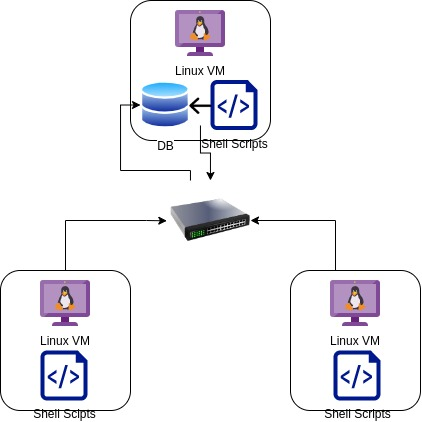

# Linux Cluster Monitoring Agent

## Introduction

LCA (Linux Cluster Administration) team has developed a Linux Cluster Monitoring application which can monitor useful information like hardware specifications and hardware usage data in real time. These include cpu, memory and disk usage related data.

We have chosen PostgresSQL Database for its robustness, scalability and security features that allow a great experience to work with.

PostgresSQL DB instance is running inside a Docker container. We are using docker image postgres:9.6-alpine for seamless experience with the database.

We have written a few Bash Scripts who are responsible for collecting the hardware specifications and real-time hardware data usage along with the timestamp and hostname which gets stored in the database because of automation.

Git Version Control has been a great choice for tracking the development process and for checkpointing purposes. It offers great features and user-friendly experience for software development projects.


## Quick Start

### Clone the repository
````
#Clone the repo
git clone https://github.com/Jarvis-Consulting-Group/jarvis_data_eng-d14mittal 

#Change directory to LCA project
cd jarvis_data_eng-d14mittal/linux_sql
````

### Create/Start/Stop Docker Container with Postgres:Alpine-9.6 Image

````
# To create a psql instance
bash ./scripts/psql_docker.sh create [db_username][db_password]

# To start a psql instance that is already created
bash ./scripts/psql_docker.sh start 

# To stop a running psql instance 
bash ./scripts/psql_docker.sh stop 
````

### Create Database host_agent in PostgresSQL DB
````
# Running the sql script creates database host_agent, host_info and host_usage tables in host_agent database 
psql -h localhost -U postgres -d host_agent -f ./sql/ddl.sql
````

### Insert hardware specs data into the DB using host_info.sh
```` 
# Insert hardware specifications into host_info table
bash ./script/host_info.sh host_agent_ip 5432 host_agent postgres password
````

### Insert hardware usage data into the DB using host_usage.sh
````
# Insert metric usage data into host_usage table using host_usage.sh
bash ./script/host_usage.sh host_agent_ip 5432 host_agent postgres password
````

### Crontab setup
````
crontab -e
#add this to crontab
* * * * * bash /home/centos/dev/jrvs/bootcamp/linux_sql/host_agent/scripts/host_usage.sh localhost 5432 host_agent postgres password > /tmp/host_usage.log
````

# Implemenation

Implementation of the LCA project has been incorporated in the Linux environment with CentOS 7 distribution. The objective of this project is to create a software product used for hardware-usage monitoring of Linux Clusters.

Project started off with the Docker Installation and Postgres:Alpine-9.6 image used for creating a Docker container running the instance of PostgresSQL DB. We now proceed to install psql CLI tool used to connect and manipulate the DB with hardware statistics.  

To incorporate the seamless monitoring of hardware metric data, we created two bash scripts ```host_info.sh``` and ```host_usage.sh```. The ```host_info.sh``` will run only once to capture the hardware specification which are constants like ```cpu_model```, ```cpu_number```, ```total_mem``` and more and stores it in the host_info table. 
Whereas the ```host_usage.sh``` runs every minute capturing the real-time hardware usage like ```memory_free```, ```cpu_idle```, ```cpu_kernel``` and stores it in the host_usage table because we configured a crontab that executes this ```host_usage.sh``` every minute.  

With the help of technology like Docker, Bash Scripting and PostgresSQL Database, we have successfully developed an efficient, we can easily and efficiently monitor a cluster of Linux Environment which is essential for testing and DevOps purposes.  

## Architecture


## Scripts
**Shell script description and usage**
- **psql_docker.sh**
  - The psql_docker.sh script has been developed to create a docker container with Postgres:Alpine-9.6 image, start an existing container or stop an existing container. 
  - Checks the running status of Docker Engine.
  - Requires database username and password for authentication.
```shell 
  ./scripts/psql_docker.sh create db_username db_password
```
- **host_info.sh**
  - The host_info.sh script will particularly focus on collecting the hardware specification of the system.
  - It requires hostname, database name, username and password as it's environment variable.
```shell
./scripts/host_info.sh "<hostname>" <port_number> "<database_name>" "<username>" "<password>"
```
- **host_usage.sh**
  - The host_info.sh script will particularly focus on collecting the real-time hardware usage of the system.
  - It requires hostname, database name, username and password as it's environment variable.
```shell
./scripts/host_usage.sh "<hostname>" <port_number> "<database_name>" "<username>" "<password>"
```
- **crontab**
  - The cron tab has been configured to run the ```host_info.sh``` every minute for real-time data capturing.
```shell
bash /home/centos/dev/jrvs/bootcamp/linux_sql/host_agent/scripts/host_usage.sh localhost 5432 host_agent postgres password > /tmp/host_usage.log
```
- **ddl.sql**
  - This script aims to connect to the database host_agent and creates the two table name host_info and host_agent
```
psql -h localhost -U postgres -d host_agent -f sql/ddl.sql
```

## Database Modeling
**host_info Table**

| Column Name      | Data Type | Description                |
|------------------|-----------|----------------------------|
| id               | SERIAL    | Unique Host id of a system |
| hostname         | VARCHAR   | Hostname of the system     |
| cpu_number       | INTEGER   | Number of CPUs             |
| cpu_architecture | VARCHAR   | Architecture of CPU        |
| cpu_model        | VARCHAR   | CPU Model information      |
| cpu_mhz          | FLOAT     | CPU Clock speed in mHz     |
| L2_cache         | INTEGER   | Level 2 cache in KB        |
| total_mem        | INTEGER   | Total memory in KB         |
| timestamp        | TIMESTAMP | Timestamp UTC format       |

**host_usage Table**

| Column Name    | Data Type | Description                             |
|----------------|-----------|-----------------------------------------|
| timestamp      | TIMESTAMP | Timestamp UTC format                    |
| host_id        | INTEGER   | Foreign key referencing host_info table |
| memory_free    | INTEGER   | Free memory in the host in MB           |
| cpu_idle       | INTEGER   | Percentage of CPU idle time             |
| cpu_kernel     | INTEGER   | Percentage of CPU kernel time           |
| disk_io        | INTEGER   | Number of disk I/O operations           |
| disk_available | INTEGER   | Available disk space in MB              |


# Test

## Check if Docker container is created
```shell
docker container ls -a -f name=jrvs-psql
```
### Result
| CONTAINER ID | IMAGE               | COMMAND                | CREATED    | STATUS      | PORTS                                      | NAMES     |
|--------------|---------------------|------------------------|------------|-------------|--------------------------------------------|-----------|
| 3348d91a801e | postgres:9.6-alpine | "docker-entrypoint.s…" | 4 days ago | Up 4 days   | 0.0.0.0:5432->5432/tcp, :::5432->5432/tcp  | jrvs-psql |


## Check if PostgresSQL Database is created
```shell
#Connect to psql instance uing psql REPL (read–eval–print loop)
psql -h localhost -U postgres -d password -W

#show all databases
postgres=# \l
```
### Result
|    Name    |  Owner   | Encoding |  Collate   |   Ctype    | Access privileges |   
|------------|----------|----------|------------|------------|-------------------|
| host_agent | postgres | UTF8     | en_US.utf8 | en_US.utf8 |                   |   


## Check if the tables are created with ddl.sql script
```shell
# Execute ddl.sql script on the host_agent database against the psql instance
psql -h localhost -U postgres -d host_agent -f sql/ddl.sql
```

### Result
You are now connected to database "host_agent" as user "postgres".  
psql:sql/ddl.sql:17: NOTICE:  relation "host_info" already exists, skipping
CREATE TABLE  
psql:sql/ddl.sql:31: NOTICE:  relation "host_usage" already exists, skipping
CREATE TABLE

## Check hardware specs are inserted into host_info table
```shell
# Running the script
./script/host_info.sh localhost 5432 host_agent postgres password

# Connecting to host_agent database
psql -h localhost -U postgres -d host_agent -W

# Query all the rows in host_info table
SELECT * FROM host_info;
```

### Result
| id | hostname                                                               | cpu_number | cpu_architecture | cpu_model     | cpu_mhz  | l2_cache | timestamp           | total_mem |
|----|------------------------------------------------------------------------|------------|------------------|---------------|----------|----------|---------------------|-----------|
| 1  | jrvs-remote-desktop-centos7.us-east1-c.c.focused-clock-389017.internal | 2          | x86_64           | AMD EPYC 7B12 | 2249.998 | 512K     | 2023-06-23 15:51:59 | 8005524   |

## Check hardware usage data are inserted into host_usage table
```shell
# Running the script
./script/host_usage.sh localhost 5432 host_agent postgres password

# Connecting to host_agent database
psql -h localhost -U postgres -d host_agent -W

# Query all the rows in host_info table
SELECT * FROM host_usage;
```

### Result
| timestamp           | host_id | memory_free | cpu_idle | cpu_kernel | disk_io | disk_available |
|---------------------|---------|-------------|----------|------------|---------|----------------|
| 2023-06-19 13:15:32 | 1       | 2551        | 90       | 1          | 0       | 19230          |
| 2023-06-20 12:56:01 | 1       | 2137        | 83       | 2          | 0       | 19003          |
| 2023-06-20 12:57:01 | 1       | 2137        | 84       | 1          | 0       | 19002          |
| 2023-06-20 12:58:01 | 1       | 2133        | 85       | 1          | 0       | 19002          |
| 2023-06-20 12:59:01 | 1       | 2122        | 86       | 1          | 0       | 19002          | 
| 2023-06-20 13:00:01 | 1       | 2122        | 87       | 1          | 0       | 19002          |
| 2023-06-20 13:01:01 | 1       | 2121        | 87       | 1          | 0       | 19002          |
| 2023-06-20 13:02:01 | 1       | 2100        | 88       | 1          | 0       | 19002          |
| 2023-06-20 13:03:01 | 1       | 2095        | 89       | 1          | 0       | 19002          |
| 2023-06-20 13:04:01 | 1       | 2094        | 89       | 1          | 0       | 19002          |
| 2023-06-20 13:05:01 | 1       | 2093        | 89       | 1          | 0       | 19002          |


# Deployment

## Docker
- Docker Installation followed by the pulling the Postgres:Alpine-9.6 image, running the docker container with this image. 
- Provisioning the PostgresSQL instance client with Docker container acting as PostgresSQL server.

## GitHub
- Followed the GitFlow strategy to create multiple feature branches.
- Organized the scripts into different folders like host_info.sh, host_usage.sh and psql_docker.sh lies in linux_sql folder whereas the ddl.sql is in sql folder.

## crontab
- Configured crontab to run the host_usage.sh every minute and push the data into database.

# Improvements
- Instead of fetching all the metrics (hardware data), or specified metric in script, client should have the control what to see.
- Setup Alerts and Trigger when the host reaches maximum cpu/memory usage, or any host shuts down.
- Graphical User Interface to make it user-friendly and dashboard to check the monitoring insights.
